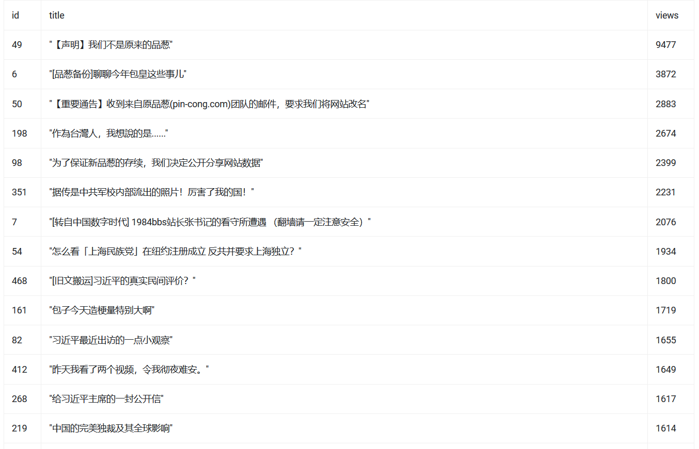
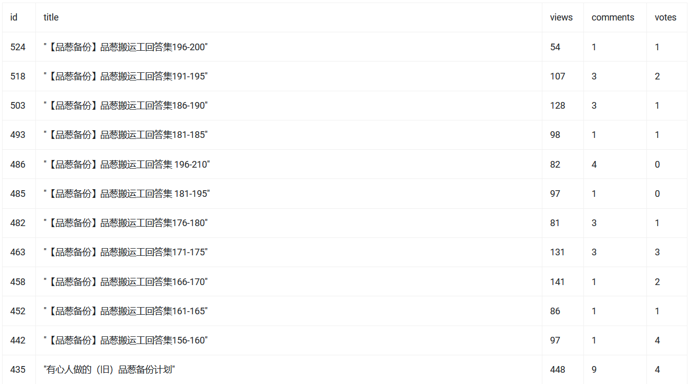

# Pincong SQL

> 新品葱（WeCenter）数据库在线查询，使用 SQL (sqlite) 语句，支持导出为 JSON 格式

## 数据来源

https://github.com/pin-cong/data/blob/master/pink.sql

## 浏览器支持

* Chrome >= 57
* Firefox >= 53
* Edge >= 16
* Opera >= 44
* Safari >= 11

已使用 Chrome 71 测试通过

## 使用示例

#### 按浏览数排序文章

```sql
SELECT id, title, views FROM aws_article ORDER BY views DESC;
```



#### "品葱备份" 话题下的全部文章

```sql
SELECT id, title, views, comments, votes FROM aws_article
WHERE id IN (
	SELECT item_id FROM aws_topic_relation 
	WHERE topic_id == (SELECT topic_id FROM aws_topic WHERE "topic_title" == "品葱备份") AND type == "article"
)
ORDER BY id DESC;
```



#### @一只鹿兒 发表的全部文章

```sql
SELECT id, title, message AS content FROM aws_article
WHERE uid == (SELECT uid FROM aws_users WHERE "user_name" == "一只鹿兒")
ORDER BY id DESC;
```

## 许可证

根据 MIT 许可证开源。
